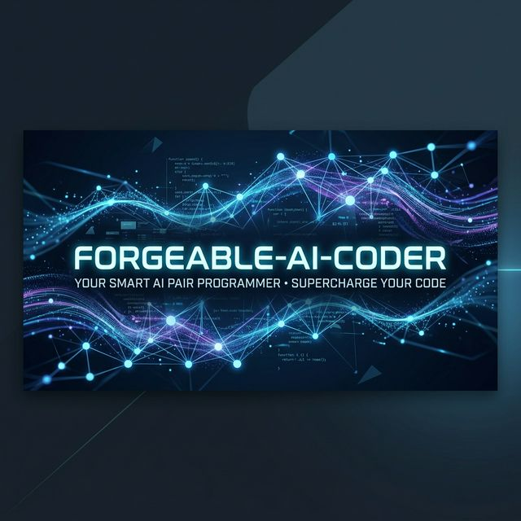

<div align="center">
  
  
  <br />
  
  # 🚀 Forgeable AI Coder
  
  **Your autonomous AI software engineering team powered by LangGraph & Groq.**

  [](https://www.python.org/)
  [](https://python.langchain.com/)
  [](https://python.langchain.com/docs/langgraph)
  [](https://groq.com/)
  
</div>

---

## 📖 Overview

**Forgeable AI Coder** is an advanced AI engineering project planner and agent. By utilizing a multi-agent state graph architecture, it translates simple natural language prompts into fully functional codebases automatically!

It breaks down complex software requests using specialized AI roles:
- 🗺️ **Planner Agent:** Understands your prompt and designs the overarching project strategy.
- 🏗️ **Architect Agent:** Breaks the plan into actionable implementation steps.
- 💻 **Coder Agent:** Iteratively writes, modifies, and saves the actual code to your local machine.

---

## ✨ Features

- **Multi-Agent Orchestration**: Specialized agents handle different parts of the software development lifecycle.
- **Iterative Implementation**: Writes code step-by-step, validating and saving along the way.
- **Local File Management**: Directly generates project files in the `generated_project/` directory.
- **High-Performance LLMs**: Powered by [Groq](https://groq.com) and the fastest open-source models for instantaneous code generation.
- **Traceable Graph Architecture**: Built with LangGraph, ensuring every step of the agent's thought process is structured and reliable.

---

## 🛠️ Tech Stack

| Technology | Purpose |
| ---------- | ------- |
| **Python 3.11** | Core Language |
| **LangGraph** | Multi-Agent Orchestration & State Management |
| **LangChain Core** | Abstractions for Tools & LLM interaction |
| **Groq API** | High-speed LLM inference |
| **Pydantic** | Strong typing and structured output parsing |

---

## 📂 Project Structure

```text
forgeable-ai-coder/
├── agent/
│   ├── graph.py       # Core LangGraph state machine & agent definitions
│   ├── prompts.py     # Carefully engineered system prompts for each role
│   ├── states.py      # Pydantic state models & schemas
│   └── tools.py       # Actions provided to the coder agent (read, write, list)
├── generated_project/ # The resulting code output written by Forgeable AI Coder
├── main.py            # Entry point of the CLI application
├── pyproject.toml     # Project metadata and dependencies
└── .env               # Environment configurations (API Keys)
```

---

## 🚀 Getting Started

### 1. Prerequisites
- Python 3.11 or higher
- [Groq API Key](https://console.groq.com/)
- `uv` or `pip` for dependency management

### 2. Installation
Clone the repository, navigate into the directory, and install the dependencies:
```bash
# Using pip
pip install -r requirements.txt # (or directly via uv/pyproject.toml)
```

### 3. Configuration
Create a `.env` file in the root directory and add your Groq API key:
```env
GROQ_API_KEY="gsk_your_api_key_here"
```

### 4. Running the Agent
Run the main script and interact with your new engineering team:
```bash
python main.py
```
*Wait for the prompt, then describe the app you want to build (e.g., "build a classic snake game using HTML5 canvas inside generated_project").*

---

## 🤝 Contributing

Contributions, issues, and feature requests are welcome! Feel free to check the [issues page](#).

## 📄 License

This project is open-source and available under standard open source provisions.

---
<div align="center">
  <i>Built with ❤️ by AI to help you build faster.</i>
</div>
